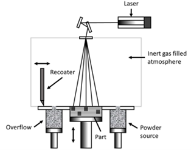
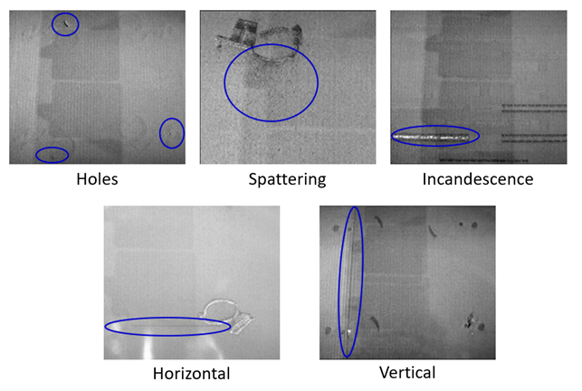

# Image Harmonization for Additive Manufacturing defect detection (AM04 - 2023/2024)

<!-- TABLE OF CONTENTS -->
<details>
  <summary>Table of Contents</summary>
  <ol>
    <li>
      <a href="#about-the-project">About The Project</a>
      <ul>
        <li><a href="#introduction">Introduction</a></li>
        <li><a href="#functional-specification">Functional Specification</a></li>
      </ul>
    </li>
    <li>
      <a href="#dataset-structure">Dataset Structure</a>
    </li>
    <li>
      <a href="#getting-started">Getting Started</a>
      <ul>
        <li><a href="#installation">Installation</a></li>
      </ul>
    </li>
    <li>
      <a href="#usage">Usage</a>
      <ul>
        <li><a href="#consingan">ConSinGAN</a></li>
        <li>
          <a href="#faster-r-cnn">Faster R-CNN</a>
          <ul>
            <li><a href="#train">Train</a></li>
            <li><a href="#test">Test</a></li>
          </ul>
        </li>
      </ul>
    </li>
    <li>
      <a href="#credits">Credits</a>
      <ul>
        <li><a href="#authors">Authors</a></li>
        <li><a href="#references">References</a></li>
        <li><a href="#license">Licences</a></li>
      </ul>
    </li>
  </ol>
</details>

<!-- ABOUT THE PROJECT -->
## About The Project

### Introduction

Metal Additive Manufacturing (AM) is a pillar of the Industry 4.0, with many attractive advantages compared to traditional subtractive fabrication technologies. However, there are many quality issues that can be an obstacle for mass production. In this context, the use of Computer Vision and Machine Learning algorithms have a very important role. Nonetheless, they are up to this date limited by the scarcity of data for the training, as well as by the difficulty of accessing and integrating the AM process data throughout the fabrication. To tackle this problem, an image harmonization algorithm is required to increase the number of images available, and a defects detection algorithm should be built to locate the defects during the process.

<p align="center">
  
  <p align="center"><strong>Figure 1:</strong> Powder Bed Fusion (PBF) process</p>
</p> 

The category of defects addressed are the following:
1. Holes: localised lacks of metallic powder that create small dark areas in the powder bed image. They are generally due to a bad regulation of the powder dosing factor, leading to local lacks of powder.
2. Horizontal defects: dark horizontal lines in the layer image caused by geometric imperfection of the piece that leads to the incorrect spreading of the metallic powder.
3.	Spattering: droplets of melted metal ejected from the melt pool and landed in the surroundings.
4.	Vertical defects: vertical undulation of the powder bed along the direction of the recoater’s path, consisting in alternated dark and light lines. The origin is either a mechanical defect of the recoater’s surface or a mechanical interference between the object and the recoater.
5.	Incandescence: high-intensity areas in the powder bed layer. It is generally a consequence of the inability of the melt pool to cool down correctly, due to an excess of laser energy power.  

<p align="center">
    
</p>

<p align="right">
  <a href="#top">
    
  </a>
</p>

### Functional Specification

Our application consists of develop a Object Detection Modele able to detect defects in Powder Bed Fusion process images, by using harmonization alogorithm to increase the number of images in order to takle the scarcity of data. In particular, we use a part of original dataset containing defects to crop them. Then we apply some transformations, like resizing, rotation, flipping, brightness, to these cropped defects and we used them combined with provided no defects images to generate new images and harmonized them using ConSinGAN model. 

Finally, we combine the original part of defects dataset and the generated images to build the training set and used it to train our Object Detection Model (`Faster R-CNN`) and test it on the remaing part of the original dataset. We also train this model directly with the original dataset to compare perfomance results.

<p align="right">
  <a href="#top">
    
  </a>
</p>

## Dataset structure

The dataset is composed of two folders:

1. `Defects`: contains a set of images with several defects like holes, spattering etc. They consist of 47 images of different layers with one or multiple defects in each of them without labeling. These images have been diveded into two subdirectory:

   - **Train**: containg 35 of the original Defects images, used to generate the training set using ConSinGAN with harmonization  
   - **Test**: containg the remaining 12 Defects images, used as test set to evaluate model performance

2. `NoDefects`: contains plain image of the powder bed without defects. They consist of 27 images without defects that have been used to generate synthetic images with defects.

3. `Masks`: containg all the cropped defects and components extrated from Defects images, divided into **Train** and **Test**. Used to both generate synthetic images and create COCO annotations for train and test set.
  
<p align="right">
  <a href="#top">
    
  </a>
</p>

<!-- GETTING STARTED -->
## Getting Started

This code has been developed and tested on [Python 3.10.2](https://www.python.org/) using [Pytorch](https://pytorch.org/)

### Installation

1. Clone the repository:
   ```
   git clone https://github.com/MLinApp-polito/mla-prj-23-mla-am04-g2.git
   ```
2. Install requirements:
   ```
   cd src
   python -m venv my_env
   source my_env/bin/activate
   pip install -r requirements.txt
   ```

<p align="right">
  <a href="#top">
    
  </a>
</p>

<!-- USAGE EXAMPLES -->
## Usage

### ConSinGAN

1. Train ConSinGAN in harmonizazion mode over a specific background image:

    ```
    python main_train.py --gpu 0 --train_mode harmonization --train_stages 2 --min_size 512 --max_size 640 --lrelu_alpha 0.3 --niter 1000 --batch_norm --input_name <INPUT IMAGE PATH>
    ```

    To train model directly over multiple backgroud refers to `run_harmonization_train.py` in utils folder, configure `image_ids`(line 50) in the code and run:

    ```
    python run_harmonization_train.py
    ```

    Harmonization training took approximately 2h on a single background image using a Nvidia RTX 4070.

2. Synthetic Image Generation using harmonized models trained at the previous step:

    ```
    python image_generation.py --dir <DEFECTS MASKS DIR> --dataset_name <DATASET NAME> --backgroud <BACKGROUND IMAGES DIR> --model <HARMONIZATION TRAINED MODELS PATH> --output <OUTPUT DIR --n_images <NUMBER OF IMAGES TO GENERATE>
    ```

    This command will create a folder containg all synthetic images generated and harmonized as well as a JSON file containig images' annotations in COCO format.

3. Generate COCO annotatios for real images:

    ```
    python generate_image_annotations.py --masks_path <DEFECTS MAKS PATH> --images_path <REAL IMAGES PATH> --annotations_path <ANNOTATIONS FILE PATH>
    ```

    In order to build training set for Faster R-CNN model, you need to apply this command to the original defects train images using the annotations JSON file returned by the previous step and then combine these images with the synthetic generate dataset. While for the test set just run this command and it will create a JSON file named accordingly to the parameter passed to it containing the correspongin annotations.

<p align="right">
  <a href="#top">
    
  </a>
</p>

### Faster R-CNN

`NB`: before start training and testing Faster R-CNN model, you need to structure `Data/` directory as descripted in the corresponding [README](/src/Data/README.md) file.

#### Train:

1. Training without Data Augmentation:

   ```
   python train.py --mode train --num_epochs 50 --batch_size 4 --save_model_path <SAVE MODEL PATH>
   ```
2. Training with Data Augmentation:

   ```
   python train.py --mode train --augmentation True --num_epochs 50 --batch_size 4 --save_model_path <SAVE MODEL PATH>
   ```
In both cases, one epoch of training need about 5 minutes for a dataset with 4000 images and batch size = 4 with a Nvidia RTX 4070
#### Test:

1. Model Evaluation using weights defined with training:

   ```
   python train.py --mode test --save_model_path <MODEL WEIGHTS FILE PATH>
   ``` 

<p align="right">
  <a href="#top">
    
  </a>
</p>

## Credits

<!-- CONTACT -->
### Authors

- Davide Natale s318967
- Salvatore Cabras s320096
- Giovanni Orani s317565
- Marco Laiolo s283816

<!-- REFERENCES -->
### References

* [Improved Techniques for Training Single-Image GANs](https://github.com/tohinz/ConSinGAN)

<!-- LICENSE -->
### License

Distributed under the MIT License. See [LICENSE](/LICENSE) file for more information.

<p align="right">
  <a href="#top">
    
  </a>
</p>